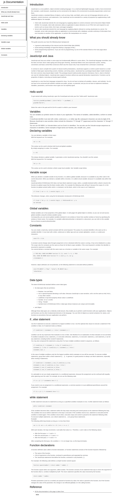

# Technical-Documentation

preview

## about

this project is a technical document explains products, systems, or processes i used to , developers, this serving to guide usage, troubleshoot issues, standardize operations, and align understanding, ultimately boosting  satisfaction, reducing support costs, enabling self-service, speeding up onboarding, and creating a competitive advantage by turning complex info into reusable asset
## usage

open the form with any browser of choice
- read the content
- search for any content or go back to the previews content without issue by using the navbar by the side
## Built using

HTML
CSS
* prerequisites
to work with or modify this project you should be able to understand the basic of HTML and style.CSS such as tags and input as show in my work

## my link you can check and verify
- To see and clone this project run: git@github.com:Dorian4563/Technical-Documentation.git
 tags and input as show in my work
